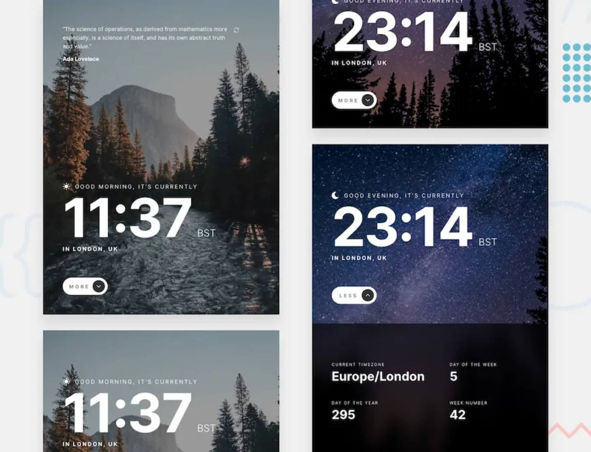

# Clock app

<div align='center'>
[Solution Repo](https://github.com/dj-drakos/fem-clock-app) | [Live Site](https://fem-clock-app-ten.vercel.app/)
</div>
<br>

This is my solution to the [Clock App Challenge](https://www.frontendmentor.io/challenges/clock-app-LMFaxFwrM) on Frontend Mentor. The challenge provided UX requirements and Figma design files for mobile, tablet, and desktop layouts. I built a responsive, stateful app that was a great opportunity to use every front-end tool in my toolbox, from React Context to keyframe animations.
<br>
<br>

## Table of contents
- [Tools & Resources](#tools--resources)
- [Highlights](#highlights)
- [The Challenge](#the-challenge)
<br>

---
<br>

## Tools & Resources
- [React.js](https://reactjs.org/)
- [Styled Components](https://styled-components.com/)
- [Radix](https://www.radix-ui.com/) - Accessible Component Primitives
- [World Time API](http://worldtimeapi.org/)
- [IP Geolocation API](https://getgeoapi.com//) 
- [Programming Quotes API](https://programming-quotes-api.herokuapp.com/) 
- [Inclusive Components](https://inclusive-components.design/)
- Semantic HTML5 markup
- CSS custom properties
- Flexbox/CSS Grid
<br>

---
<br>

## Highlights
  - [Fluid Grid](#fluid-grid)
  - [Accessible Collapsible Element](#accessible-collapsible-element)
  - [Continued development](#continued-development)
<br>

### Fluid Grid

The desktop and tablet versions of the UI were designed using a 12-column grid. The content is divided into three major sections: a random quote, the clock display, and a collapsible clock details panel. <br>

To build a fluid grid, I created `GridContainer` and `GridItem` wrapper components inspired by [Material UI](https://mui.com/material-ui/react-grid/). The `GridItems` span all columns by default, or can accept props to customize span and placement at small, medium, large, or extra large breakpoint. Any custom grid props are inheirited by wider breakpoint sizes. Internally, the Grid components use flexbox and can accept style attributes as props to customize the flex attributes of children elements. 
<br>

The resuable components allow managing positioning for multiple screen sizes efficiently and independently throughout each section of the app, while maintaining a single source of truth for the declaration of the grid style. 
<br>
<br>

Here's the code for the collapsible details panel:
<br>

```
<GridContainer alignContent="center">
  <GridItem m={6} >
  { ... }
  </GridItem>

  <GridItem m={1} />
            
  <GridItem m={5} >
  { ... }
  </GridItem>
</GridContainer>
```
<br>

Which looks like this: 
<br>
<br>
<div align="center">
  [Fluid Grid](./src/assets/readme/fluid_grid.mp4)
</div>
<br>
<br>

### Accessible Collapsible Element

It was important to incorporate functionality that led with accessibility. 
<br>

I used several [Radix](https://www.radix-ui.com/) primitives, including the [Collapsible](https://www.radix-ui.com/docs/primitives/components/collapsible) component to power the clock details section. 
<br>

It was a fun challenge adding an animation on top of the Radix Collapsible because the API doesn't expose state for controlling the toggle, and the render method disrupts the timing of external transition effects. With a combination of scroll methods, keyframe animations, and a class toggle, I created a smooth mount and unmount effect that keeps the collapsible component fixed to the bottom edge of the viewport across all screen breakpoints, and complies with accessibility reccomendations for toggling element visibility. 
<br>

  <div align="center">
    [Toggle Collapsible Animation](./src/assets/readme/toggle_animation.mp4)
  </div>
<br>

### Continued Development

I built the app during a 1-week sprint. These are my priorities if I had one more week:
- 🧪&nbsp; Write unit and integration tests for CI
- 🧪&nbsp; Add error handling and error boundaries to the component tree
- 🧪&nbsp; Do a (more robust) Accessibility audit
<br>

---
<br>

## [The Challenge](https://www.frontendmentor.io/challenges/clock-app-LMFaxFwrM)
<br>
  <div align="center">
    
  </div>
<br>
<br>

### Users should be able to:
- ✅&nbsp; View the optimal layout for the site depending on their device's screen size
- ✅&nbsp; See hover states for all interactive elements on the page
- ✅&nbsp; View the current time and location information based on their IP address
- ✅&nbsp; View additional information about the date and time in the expanded state
- ✅&nbsp; Be shown the correct greeting and background image based on the time of day they're visiting the site
- ✅&nbsp; Generate random programming quotes by clicking the refresh icon near the quote
<br>
<br>

### Expected Behaviour:
- ✅&nbsp; Change the greeting depending on the time of day. It should say:
  - "Good morning" between 5am and 12pm
  - "Good afternoon" between 12pm and 6pm
  - "Good evening" between 6pm and 5am
- ✅&nbsp; Change the greeting icon and background image depending on the time of day. They should show:
  - The sun icon and the daytime background image between 5am and 6pm
  - The moon icon and the nighttime background image between 6pm and 5am
- ✅&nbsp; Generate a new random programming quote whenever the refresh icon is clicked